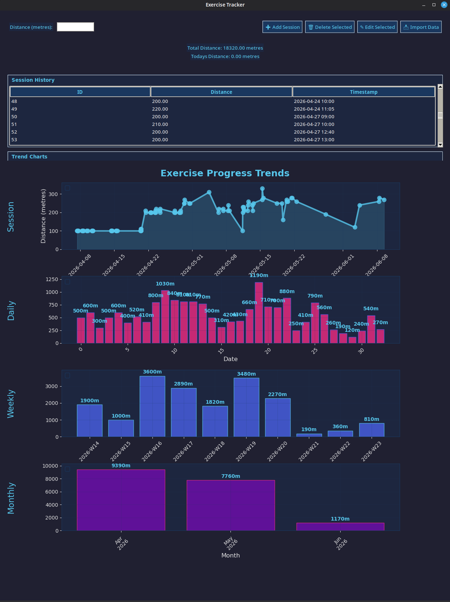

# Exercise Tracker

[](https://www.python.org/)
[](LICENSE)
[]()

A professional, modern desktop application for tracking exercise sessions with detailed analytics and visual charts. Built with Python, Tkinter, and Matplotlib.

<div align="center">



</div>

## ✨ Features

| Feature | Description |
|---------|-------------|
| 📊 Session Tracking | Record exercise distance with automatic timestamps |
| 📈 Trend Analysis | Four chart views: Session, Daily, Weekly, Monthly |
| 📂 Data Import | Import historic data from text files |
| ❌ Clear Data | Wipe all records with confirmation prompt |
| 📉 Statistics | Total and today's distance displayed in real-time |

## 🚀 Installation

### Prerequisites

- **Python 3.6** or higher
- **pip** package manager

### Quick Start

```bash
# Clone the repository
git clone https://github.com/sirkatar/exercise-tracker.git

# Navigate to project directory
cd exercise-tracker/exercise_tracker

# (Optional) Create a virtual environment
python3 -m venv venv
source venv/bin/activate        # Linux/macOS
venv\Scripts\activate           # Windows

# Install dependencies
pip install -r requirements.txt

# Run the application
python main.py
```

## 📋 Dependencies

| Package | Purpose |
|---------|---------|
| `tkinter` | GUI framework (pre-installed with Python) |
| `matplotlib` | Chart visualisation |
| `pandas` | Data aggregation and analysis |

> **Note:** `sqlite3` is included in the Python standard library — no additional installation needed.

## 🎯 Usage

### Recording a Session

1. Enter distance in **metres**
2. Click **"Add Session"**
3. Record appears immediately in session history table

### Viewing Trends

Scroll to the **Trend Charts** section at the bottom for 4 visual graph types:

- **Session Chart** — Individual session distances over time
- **Daily Chart** — Total distance per day
- **Weekly Chart** — Aggregated weekly totals
- **Monthly Chart** — Aggregated monthly totals

### Importing Historic Data

1. Click **"Import"** button
2. Select a text file containing distance entries
3. Records are validated and added to the database

### Editing & Deleting

- Double-click a row in session history to edit
- Select a row and click **"Delete Selected"** to remove it

## 🖥️ System Requirements

| Component | Minimum | Recommended |
|-----------|---------|-------------|
| OS | Windows 10, macOS 10.14+, Ubuntu 20.04+ | Latest stable release |
| RAM | 512 MB | 1 GB+ |
| Disk | 100 MB | — |

## 🛠️ Project Structure

```
exercise_tracker/
├── main.py                  # Application entry point
├── requirements.txt         # Python dependencies
└── exercise_tracker/
    ├── controllers/
    │   └── exercise_controller.py   # Business logic
    ├── models/
    │   └── exercise_model.py        # Data model
    ├── services/
    │   └── database_service.py      # SQLite backend
    ├── views/
    │   └── main_view.py             # Tkinter GUI
    └── utils/
        └── chart_utils.py           # Matplotlib helpers
```

## 🎨 Theme

Dark professional design with blue accent colours:

| Element | Colour | Hex |
|---------|--------|-----|
| Main background | Deep navy | `#1a1a2e` |
| Panel backgrounds | Blue-grey | `#16213e` |
| Accent / titles | Sky blue | `#4cc9f0` |
| Body text | Light grey | `#e6e6e6` |

## 📝 Changelog

### v1.0.0 (Initial Release)
- Session recording with distance tracking
- Four chart views for multi-level analytics
- Import/export functionality
- Professional dark theme UI

## 🔮 Future Plans

- [ ] Export data to CSV
- [ ] Multiple exercise types support
- [ ] Goal tracking and notifications
- [ ] Mobile companion app

## 🐛 Known Issues

| Issue | Status |
|-------|--------|
| Matplotlib legend warnings on empty charts | [Open](https://github.com/sirkatar/exercise-tracker/issues/1) |

## 🤝 Contributing

Contributions are welcome! Please feel free to submit a pull request or open an issue for bugs and feature requests.

1. Fork the repository
2. Create a feature branch (`git checkout -b feature/my-feature`)
3. Commit changes (`git commit -am 'Add my feature'`)
4. Push branch (`git push origin feature/my-feature`)
5. Open a Pull Request

## 📄 License

This project is licensed under the [MIT License](LICENSE) — see the LICENSE file for details.

## 👤 Author

**sirkatar** — [GitHub Profile](https://github.com/sirkatar)

---

<div align="center">

**⭐ If you find this project useful, please consider giving it a star!**

Made with ❤️ in Python

</div>
